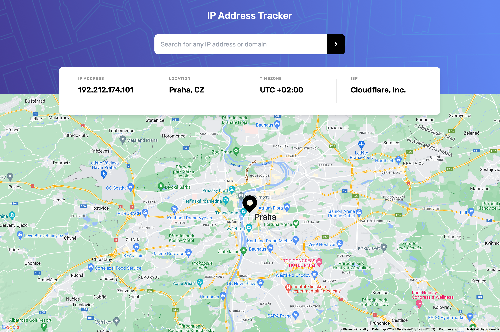

# IP Address Tracker

**IP Address Tracker** is a web application that allows users to track IP addresses and view their corresponding locations on a map. This project is built using React and utilizes various APIs to provide geolocation information.

## Live Demo

Check out the live demo of the IP Address Tracker: [Live Demo](https://vacii.github.io/ip-address-tracker/){:target="_blank"}

## Screenshots

|                       Desktop                       |                       Mobile                       |
| :-------------------------------------------------: | :------------------------------------------------: |
|  |  |

## Features

- Track IP addresses and view their locations on a map.
- Search for any IP address or domain.
- Display detailed information about the IP address, including its location, timezone, and ISP.
- Responsive design for both mobile and desktop.

## Technologies Used

- React
- React Google Maps API
- IPify API
- Geo IPify API
- HTML5/CSS3

## Installation

1. Clone the repository: `git clone https://github.com/Vacii/ip-address-tracker.git`
2. Navigate to the project directory: `cd ip-address-tracker`
3. Install dependencies: `npm install`
4. Set up API keys for Google Maps and Geo IPify by creating a `.env` file with the following content:

```
VITE_GEO_API_KEY=your_geo_api_key
VITE_GOOGLE_API_KEY=your_google_api_key
```

5. Start the development server: `npm start`

## Usage

- Access the application through your web browser.
- Enter an IP address or domain in the search input and press the search button.
- View the location on the map along with detailed information about the IP address.

## Contributing

Contributions are welcome! If you'd like to contribute to this project, please follow the standard GitHub workflow:

1. Fork the repository.
2. Create a new branch for your feature or bug fix: `git checkout -b feature-name`.
3. Commit your changes: `git commit -m "Add feature-name"`.
4. Push to the branch: `git push origin feature-name`.
5. Create a Pull Request.

## License

This project is licensed under the MIT License - see the [LICENSE](LICENSE) file for details.
